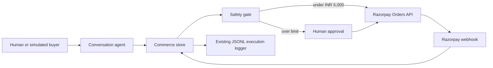

# NexusCommerce Architecture

NexusCommerce extends the existing Express and Next.js application. It does not turn payment into a desktop automation step.

## Boundaries

- `catalog.ts` is the only source of product names, prices, and upsell relationships.
- `conversationAgent.ts` returns a strict action object and can mutate the cart only through `commerceStore.ts`.
- `commerceStore.ts` is currently in-memory, matching Nexus's existing session store. Its composite `(sessionId, idempotencyKey)` map is the unique checkout key. A future database migration should enforce that pair with a unique constraint.
- A checkout retry with the same idempotency key reuses the existing transaction. An in-flight request shares its promise, preventing duplicate Razorpay orders. A new key is required after a failed payment; captured sessions cannot be checked out again.
- The INR 5,000 limit is a conservative human-control boundary. Small demo purchases can proceed automatically, while unusually large payments require an explicit approval action.
- Razorpay credentials are environment-only. The server creates orders; Razorpay Checkout or the test payment environment authorizes them, and signed webhooks finalize state.
- Commerce events are appended through the existing `Executionlogger.ts`, so payment decisions remain observable alongside automation activity.

## State flow

`browsing -> checkout_initiated -> payment_pending -> completed` or `failed`.

An over-limit cart enters `payment_pending` before an order is created. A rejected approval becomes `failed`. All checkout decisions include a human-readable gating decision and reasoning.